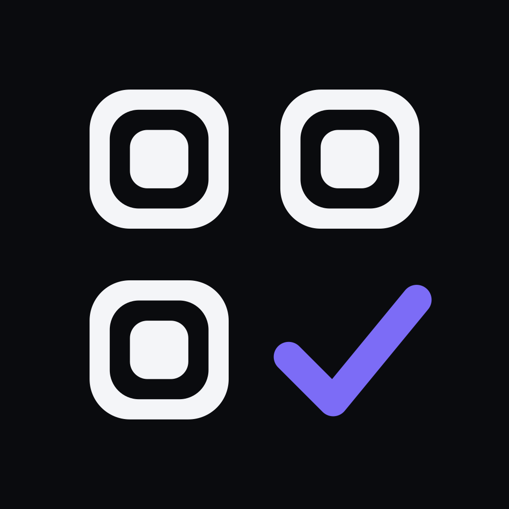
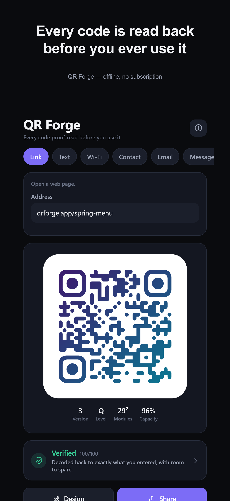
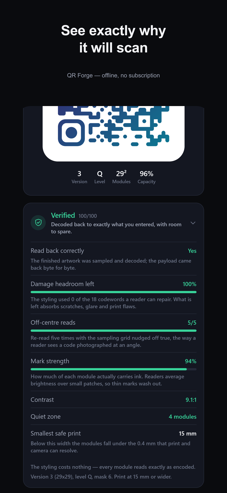
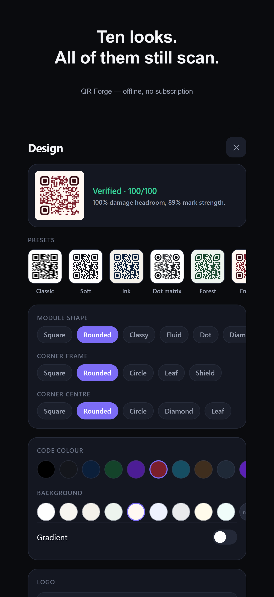

<div align="center">



# QR Forge

**The QR code generator that reads its own work back before it hands it to you.**

Static codes · no account · no network · no subscription · no ads · no tracking

</div>

---

## The claim

Every QR generator can draw a code. The interesting question is whether the
one you just styled — rounded modules, a gradient, your logo punched through
the middle — is still going to scan off a printed menu in bad light.

Every tool surveyed for this project answers that question with a rule of
thumb. This one answers it with a decode.

> **After the artwork is drawn, QR Forge samples that finished drawing the way
> a camera does and runs it through a complete Reed–Solomon decode. If your
> payload does not come back byte for byte, you are told before you export
> anything.**

That is a falsifiable claim, so the rest of this file is the evidence.

## What it looks like

| Make it | Prove it | Style it |
|---|---|---|
|  |  |  |

---

## The scan check

Drawing and verifying share one geometry model. The renderer does not emit
SVG directly — it builds a list of primitive shapes in module coordinates, and
*that* list is what the SVG exporter, the on-screen preview, the PNG exporter
and the verifier all consume. So the thing measured is the thing exported, not
an idealised grid that happens to look similar.

The check then does four things:

**1. It samples like a reader.** For every module it takes points across the
centre of the cell, averages the luminance, and binarises against the midpoint
of the observed range — the same decision a scanner's binariser makes.

**2. It decodes for real.** The sampled matrix goes through format-information
recovery (BCH), unmasking, de-interleaving, and full Reed–Solomon error
correction. The recovered string is compared against your exact input. Not a
checksum, not a heuristic — the actual decode.

**3. It assumes the reader is slightly wrong about where the grid is.** A real
reader locates the grid from the three corner patterns and interpolates, and
on a photograph that estimate drifts. So the whole read is repeated five times
with the sampling grid nudged off true. A design that only survives a perfect
read is reported as risky, because it is.

**4. It is deliberately pessimistic about your logo.** Every module the logo
artwork touches is counted as read *incorrectly*, not merely missing — because
the app cannot know what your logo looks like. The damage headroom it reports
is therefore a floor, not a hope.

What comes back is not a badge. It is numbers:

| Reported | Meaning |
|---|---|
| **Read back correctly** | Whether the decode returned your exact payload |
| **Damage headroom left** | Codewords the styling spent, out of the symbol's repair budget |
| **Off-centre reads** | How many of the five mis-registered reads survived |
| **Mark strength** | Share of each module's area actually carrying ink |
| **Contrast** | Foreground vs background ratio, and a warning when inverted |
| **Quiet zone** | Modules of clear margin, against the standard's 4 |
| **Hidden by the logo** | Share of the symbol the logo covers |
| **Smallest safe print** | Width below which modules fall under 0.4 mm |

There is also a **"fit the largest logo that still scans"** button, which
bisects on logo size against the verifier rather than against a rule of thumb.
In testing it settles between 9% and 31% of the code's width depending on the
payload — a range no fixed "keep it under 25%" guideline could have given you.

---

## The evidence

Everything below is produced by `npm test`, which runs three suites against
two independent third-party decoders and one independent reference encoder.

```
npm test
```

### Reed–Solomon layer — 7/7

- The **ISO/IEC 18004 Annex I worked example** reproduces its published
  error-correction codewords exactly.
- ~800 randomised trials across every parity length from 4 to 30: any error
  pattern up to `t = ⌊ecLen/2⌋` symbols is corrected to the exact original.
- Beyond capacity, the decoder returns *failure* rather than a plausible
  wrong answer — the miscorrection case, which is the one that actually
  matters, since a silent miscorrection is a QR code that confidently sends
  someone to the wrong URL.

### Encoder conformance — 47/47

- **Total codewords for all 40 versions** match the published Table 7 values.
- **All 160 (version, level) capacities** cross-validated against an
  independent reference encoder: a payload of exactly the computed byte
  capacity lands on that version in both implementations, and one byte more
  spills to the next version in both.
- **2,963 differential symbols** against the [`qrcode`](https://www.npmjs.com/package/qrcode)
  reference encoder, with the mask pinned on both sides:
  **2,941 byte-identical**, and the remaining 22 are equal-cost segmentation
  ties where this encoder's bit length is no worse than the reference's.
- **1,440 single-mode symbols** — where segmentation is unambiguous — are
  byte-identical to the reference, module for module.
- **Version selection is never worse** than the reference on any of the 2,963.
- **528 round trips** through this project's own decoder across ASCII, Arabic,
  Japanese, emoji, accented Latin, vCard and empty payloads, at all four
  levels, with zero phantom error corrections on clean matrices.
- **200 reference-encoded symbols** decode correctly through this decoder,
  proving the decoder is not merely agreeing with its own encoder.
- **100 symbols damaged to 100% of their stated correction budget**, block by
  block, recover the payload byte-perfectly.
- The automatic mask always achieves the minimum ISO penalty score, checked
  against all eight masks.

### Artwork and scan check — 18/18

This is the part that matters, so it is a controlled comparison rather than a
set of assertions about individual images.

Both third-party decoders have symbols they sporadically fail to *locate* —
confirmed by feeding them the reference encoder's own rendering of the same
payload, which fails identically. So a plain black-and-white control group
establishes the noise floor first, and styled designs are measured against it:

| Group | ZXing reads | jsQR reads |
|---|---|---|
| **Plain control** — black on white, no styling | **87.5%** | 100% |
| **Styled** — all 6 module shapes, at app defaults | **99.1%** | 57.9% |

Per module shape, under ZXing: square 94.4%, rounded 100%, dot 100%,
diamond 100%, classy 100%, fluid 100%.

**Styling this app approves does not cost you readability.** It measures
*better* than the plain control, because ZXing's sporadic misses are
image-specific rather than style-specific.

And the check has real discrimination — it is not just approving everything:

| The app says | Designs | ZXing reads |
|---|---|---|
| Verified (excellent or good) | 180 | **95.9%** |
| Warned about | 468 | **68.2%** |

That gap is the product. A 27-point spread between what it approves and what
it flags, across 648 aggressively-styled designs, is what "proof-read" means
in practice.

> **An honest note on jsQR.** The second decoder reads plain codes perfectly
> but drops to 57.9% on stylised modules. That is a property of jsQR — a
> deliberately small decoder with a simple block binariser — not of the
> designs, and it is true of any generator's styled output, not just this
> one. It is reported here rather than hidden because it is the sort of number
> a marketing page would leave out. It is also why the app reports **mark
> strength** and warns when modules get thin: that metric is exactly what
> predicts a lightweight decoder struggling.

### Decoders and references used

| Project | Role | Relationship to this code |
|---|---|---|
| [`@zxing/library`](https://github.com/zxing-js/library) | Primary independent decoder | None — the lineage behind most production scanners |
| [`jsqr`](https://github.com/cozmo/jsQR) | Second independent decoder | None |
| [`qrcode`](https://github.com/soldair/node-qrcode) | Reference encoder for differential testing | None |

All three are dev-dependencies used only by the test suite. **The shipped app
has no QR dependency at all** — encoder, decoder, renderer and verifier are
this repository's own code.

---

## How it compares

Dimensions chosen because they are checkable, not because they flatter.

| | Typical top-ranked iOS QR app | Typical web generator | **QR Forge** |
|---|---|---|---|
| Verifies the styled code decodes | ✗ | ✗ | **✓ full Reed–Solomon decode** |
| Reports damage headroom left | ✗ | ✗ | **✓ codewords spent vs budget** |
| Models reader mis-registration | ✗ | ✗ | **✓ 5 off-centre reads** |
| Logo sizing | fixed rule of thumb | fixed rule of thumb | **✓ bisected against the decoder** |
| Warns on low contrast / inverted | ✗ | rare | **✓ with the ratio** |
| Subscription | common, $3–$30/mo | common for dynamic | **none** |
| Ads | common | — | **none** |
| Account required | common | common | **none** |
| Network access | yes | yes | **none — the app makes zero requests** |
| Codes expire if you stop paying | n/a | **yes, for dynamic codes** | **never — static only** |
| Vector export | sometimes paid | sometimes paid | **✓ SVG + vector PDF, free** |
| Open source | ✗ | ✗ | **✓ engine, checker and tests** |

Where the category is genuinely better: dynamic codes with editable
destinations and scan analytics. That needs a server, and a server is the
thing that can switch your printed code off. See
[RESEARCH.md](RESEARCH.md) for the full survey and the complaint threads
behind these rows.

---

## The engine

Written from ISO/IEC 18004, no QR libraries:

- **All 40 versions**, 21×21 through 177×177.
- **All four error-correction levels**, with free upgrades — if the chosen
  version has spare room, the level is raised at no size cost.
- **Numeric, alphanumeric and byte modes** with **cost-optimal segmentation**:
  a dynamic program over the three modes, costed in sixths of a bit so the
  fractional per-character costs (10/3 and 11/2) stay exact. This is why the
  encoder never picks a larger version than the reference.
- **ECI**, emitting the UTF-8 designator when content leaves ISO-8859-1.
- **All eight mask patterns**, scored on the four penalty rules of clause
  7.8.3.1 including the finder-lookalike rule with the light border handled.
- **Reed–Solomon over GF(2⁸)** in both directions — encode for generation,
  Berlekamp–Massey / Chien / Forney decode for verification.
- Alignment-pattern coordinates **computed** from clause 6.3.5 rather than
  tabulated, so they cannot drift out of sync.

Pure TypeScript with no React imports, so the whole engine runs under plain
Node — which is what makes the test suite above possible.

```
src/qr/
  spec.ts       tables, capacities, alignment geometry, mask predicates
  rs.ts         GF(2^8) arithmetic, RS encode and decode
  encode.ts     segmentation, codewords, interleaving, matrix, masking
  decode.ts     format recovery, de-interleave, RS repair, bit-stream parse
  render.ts     shape model -> SVG paths (shared by every render target)
  raster.ts     analytic rasteriser and colour maths
  verify.ts     the scan check
  payloads.ts   14 content types and their escaping rules
```

---

## What it does

**14 content types** — Link, Text, Wi-Fi, Contact (vCard 3.0), Email, Message,
Phone, Location, Calendar event, WhatsApp, Social, App listing, Crypto
(BIP-21), and Raw for typing a payload byte for byte.

Each one escapes properly. Wi-Fi and MeCard values backslash-escape
`\ ; , " :`; vCard and iCalendar use their own rules. A Wi-Fi password with a
semicolon in it produces a working code here, which is not true everywhere.

**Design** — 6 module shapes, 5 corner frames, 5 corner centres, linear and
radial gradients, independent eye colour, adjustable quiet zone, module
spacing and background rounding, plus a centre logo with a padding ring and
the fit-safely search. 10 curated presets, every one of them covered by the
test suite.

**Export** — PNG at up to 4096 px, **SVG** and **vector PDF** for print, all
free. Share sheet, save to Photos, copy the raw payload.

**Scanner** — reads a code and shows you the destination *before* anything
opens, which is the answer to a sticker pasted over a real one.

**Library** — everything you make or scan, on the device, with the design
preserved so you can reopen and edit it.

---

## Privacy

The app makes **no network requests of any kind**. Not "we don't sell your
data" — there is no code in it that could send anything anywhere. No account,
no analytics, no crash reporting, no ad SDK.

Your library, your logo images and your settings live in the app's own storage
on your phone. Deleting the app deletes them.

Because the codes are static, your content is encoded in the pattern itself.
Nothing is stored on anyone's server, and no code you print can ever be
switched off, redirected, or moved behind a paywall.

---

## Build and check it yourself

```bash
npm install
npm test          # all three suites, ~5 minutes
npm run typecheck
npm run web       # the app in a browser
```

The tests are the argument. If any claim in this file is wrong, `npm test`
should say so — please open an issue if it does not.

---

## Limitations, stated plainly

- **No dynamic codes.** By design, for the reasons above. If you need editable
  destinations or scan analytics, you need a redirect service.
- **No Kanji mode.** Japanese text encodes correctly through UTF-8 byte mode,
  just less densely than the standard's fourth mode would manage.
- **QR only.** No Data Matrix, Aztec, PDF417 or 1D barcodes.
- **iPhone only.** The layout is built for one hand; a stretched iPad build
  would be worse than none.
- **The scan check is a model, not a lab.** It simulates a reader's sampling,
  binarisation and grid mis-registration, and it is validated against two
  independent decoders across thousands of reads. It is not a rig of fifty
  physical phones photographing printed cards. It is a great deal more than
  the rule of thumb it replaces, and the numbers above say how much more.

---

## Licence

MIT. QR Code is a registered trademark of Denso Wave Incorporated; QR Forge is
not affiliated with Denso Wave.
